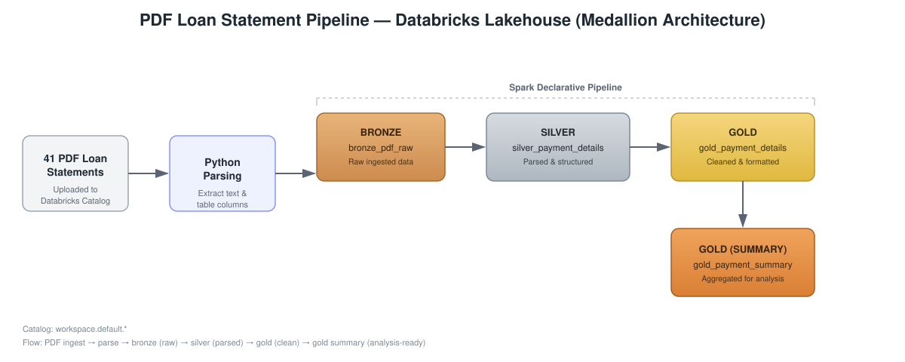

# DataBricks_PDF_Payment_Processing_Pipeline
# PDF Loan Statement Extraction Pipeline

This repository provides a Spark-based pipeline for converting unstructured PDF loan statements into clean, structured data ready for analysis. It parses PDF documents, extracts the required fields, and loads them into a set of Databricks Delta tables following the **medallion architecture** (Bronze → Silver → Gold).

## Overview

Loan statements arrive as PDF files. This pipeline ingests them into Databricks, parses the relevant fields using Python, and progressively refines the data through raw, structured, and analysis-ready layers — culminating in a summarized table used for downstream calculations and reporting.

## Architecture

## Pipeline Steps

| Step | Description | Output Table |
|------|-------------|---------------|
| 1. Ingest | ~41 PDF loan statements are uploaded into the Databricks catalog | — |
| 2. Parse | PDFs are parsed with Python to extract required fields | — |
| 3. Bronze | Raw parsed output is landed as-is | `workspace.default.bronze_pdf_raw` |
| 4. Silver | Parsed data is structured into defined columns | `workspace.default.silver_payment_details` |
| 5. Gold | Data is cleaned, validated, and formatted | `workspace.default.gold_payment_details` |
| 6. Gold Summary | Records are aggregated into summary metrics for analysis | `workspace.default.gold_payment_summary` |

## Table Catalog

All tables are stored under the `workspace.default` catalog/schema:

- **`bronze_pdf_raw`** — Raw ingested data straight from PDF parsing, no transformations applied.
- **`silver_payment_details`** — Parsed and structured payment details, one row per extracted record.
- **`gold_payment_details`** — Cleaned, deduplicated, and formatted payment details ready for reporting.
- **`gold_payment_summary`** — Aggregated summary table used for downstream calculations and analysis.

## Tech Stack

- **Databricks** — orchestration, catalog, and compute
- **Spark Declarative Pipelines** — pipeline definition and execution
- **Python** — PDF parsing and field extraction

## Getting Started

1. Upload source PDF loan statements to the configured Databricks volume/catalog location.
2. Run the pipeline notebook/job to execute the Bronze → Silver → Gold flow.
3. Query `workspace.default.gold_payment_summary` for the finalized, analysis-ready data.

